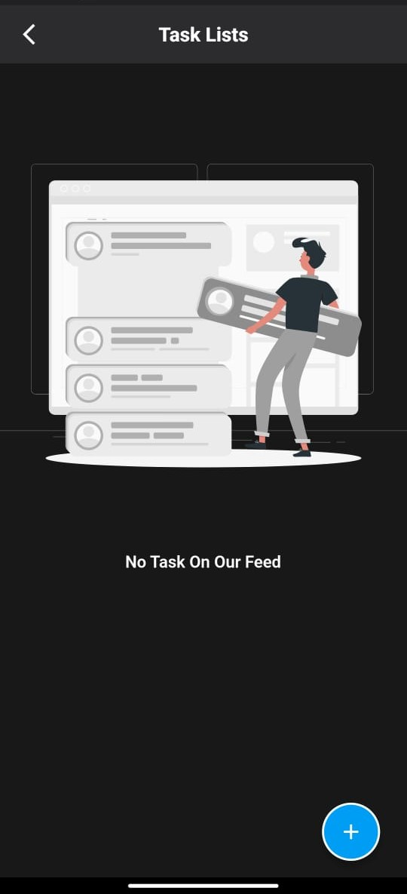
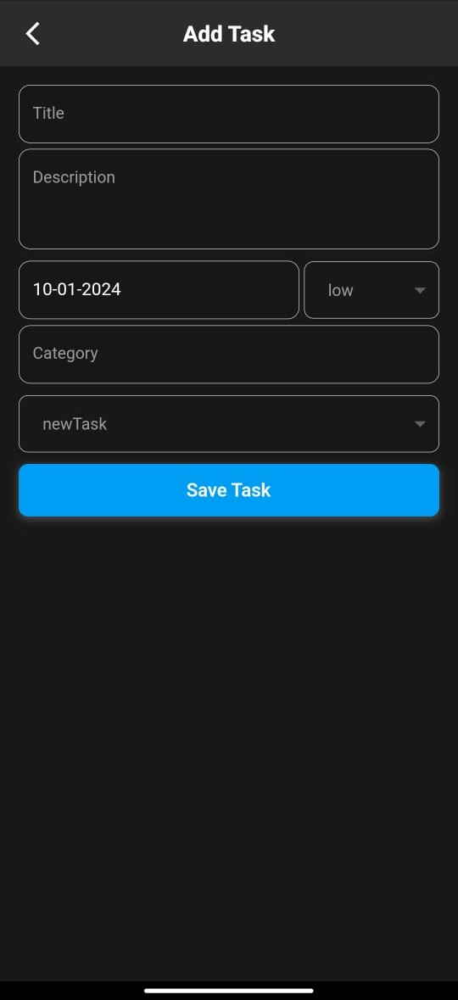
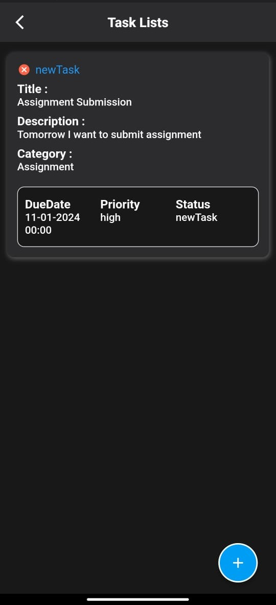
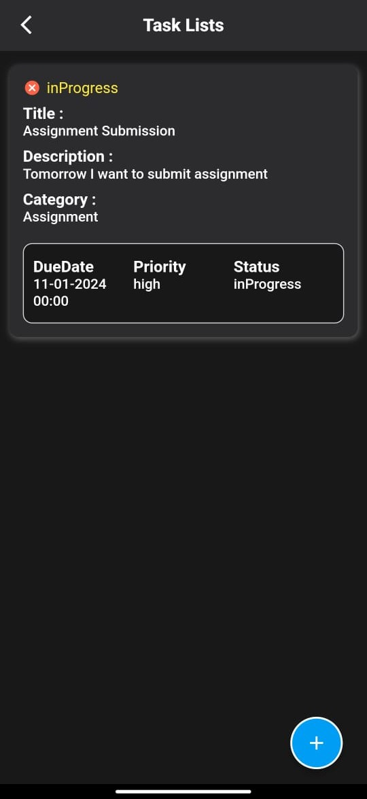
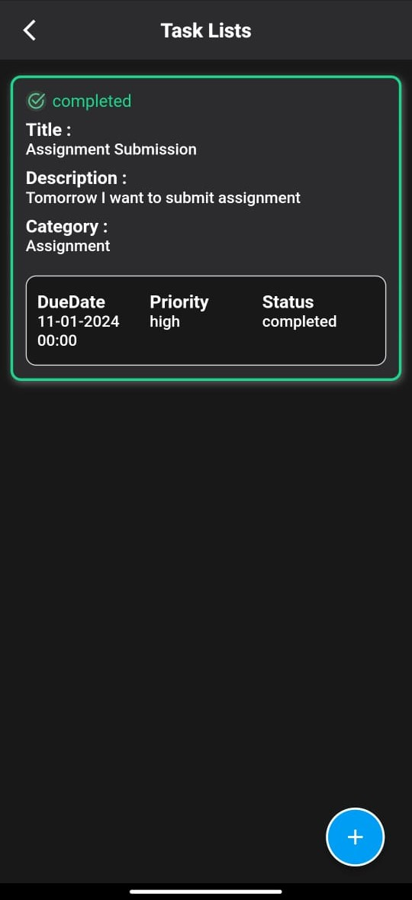
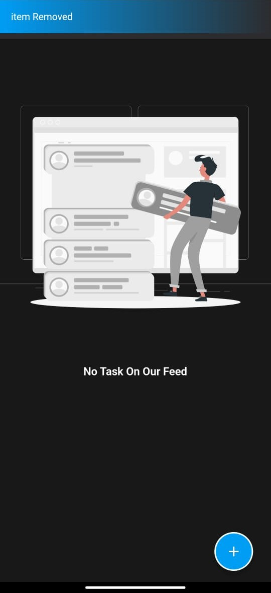

# ToDo_App

<h3>A simple ToDo List App built using Flutter and Dart.</h3>  
 

## Download APK File here

## Screenshots

<h5>App Home</h5>

<h5>By clicking + button on home we will redirect to this screen</h5>

<h5>When New Task is created</h5>

<h5>When Task is inprogress</h5>

<h5>When Task is completed</h5>

<h5>When Task is deleted</h5>

